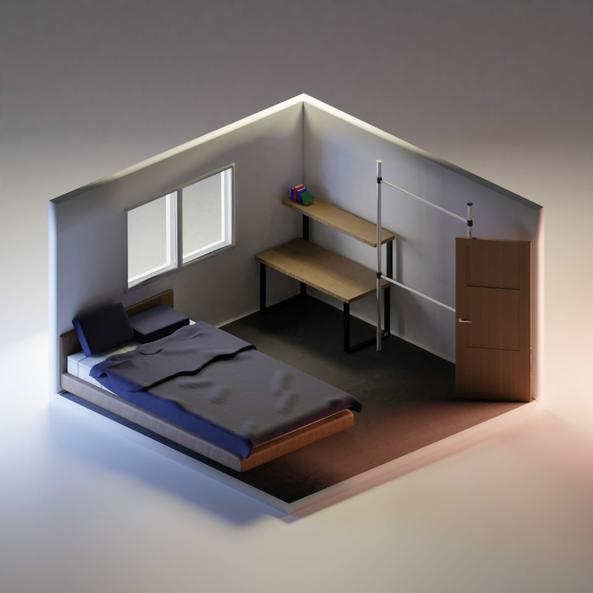

#### 분기별 정리

##### 1분기 (2020.1 - 2020.3)

- 마음에 안 드는 서비스 시작과 마음에 드는 서비스의 서포트
- 성동 왕십리 → 동작 사당으로 이사
- 코로나 터지기 전까지 카페/맛집 찾아다니기

##### 2분기 (2020.4 - 2020.6)

- //
    
##### 3분기 (2020.7 - 2020.9)
 
- //
 
##### 4분기 (2020.10 - 2020.12) 

- Blender 꽤나 다룰 수 있게 됨 (Developer + 3D Model Creator)
- 사무실 이사 (선릉 → 강남)
- [Kgenots Github Blog](https://kgenots.github.io) 블로그 개설   

2019년 회고는 시작도 하지 못하고, 2020년 회고는 남은게 없다.
회사에서 시작해서, 집에서 끝나는 한 해였다.
많은 것이 멈춰있었고, 큰 것이 바뀐 한 해였다.

---
  
#### 2021년 계획 

- 라이프에 집중하기 (굳이 여러 일을 도맡을 필요는 없지 않을까?)

- 문서 작성하기 (블로그, PPT 등)
  - 업무 관련 : 3D Graphics 
  - 비업무 관련 : PPT 작성방법, 팁
  - 게임 관련 : 공략??

- 계정 새로 파기
  - 카카오톡 사용한지 10년차에 정리 모드
  - 가입하는 서비스 기록하기

- 길게 멀리 내다보기